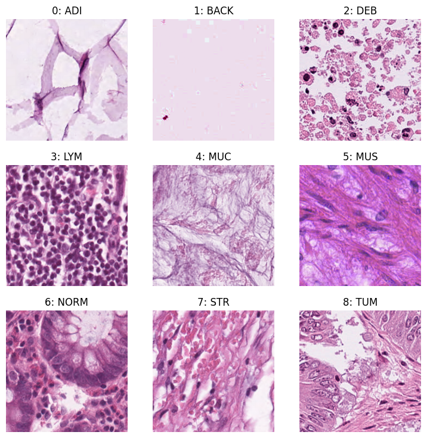
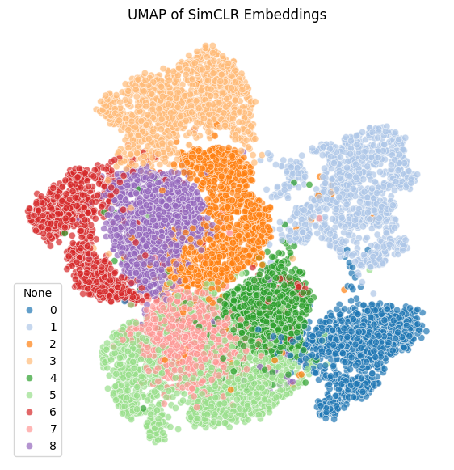
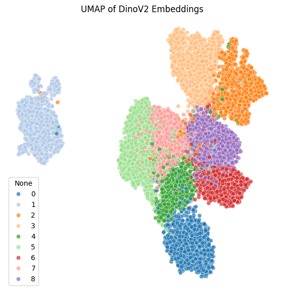
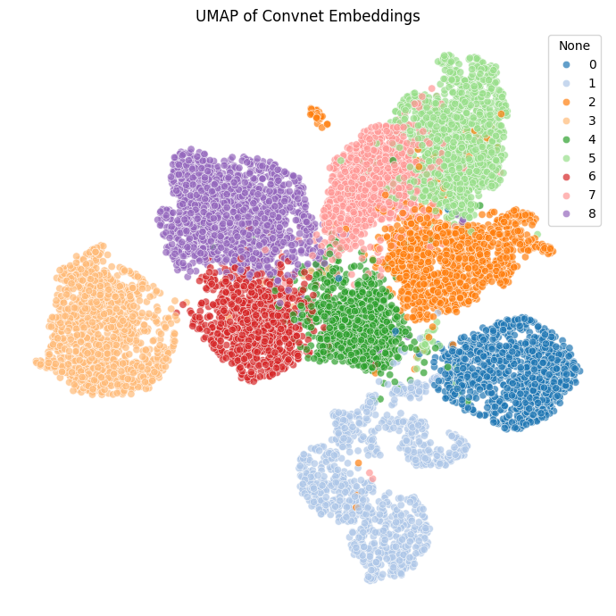
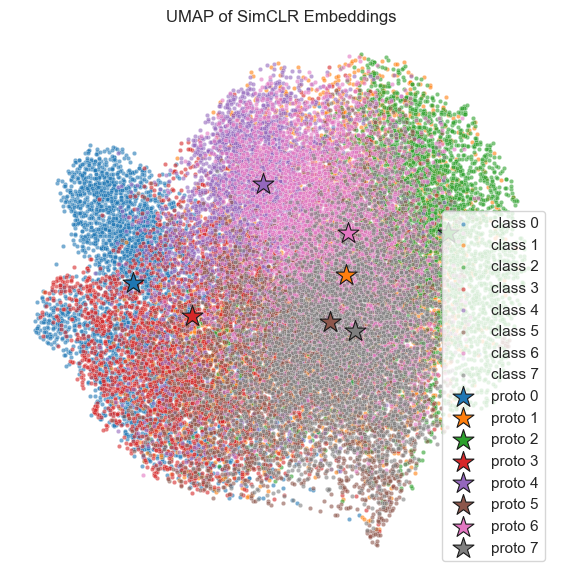
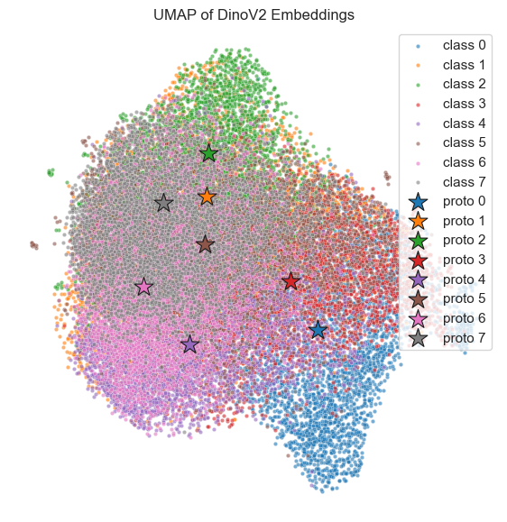
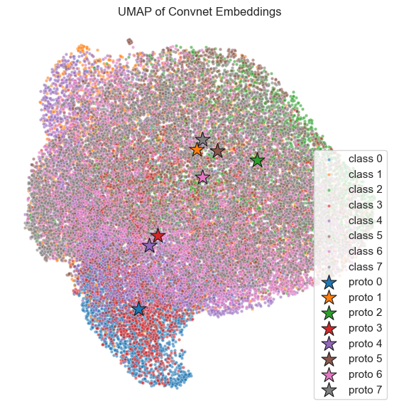
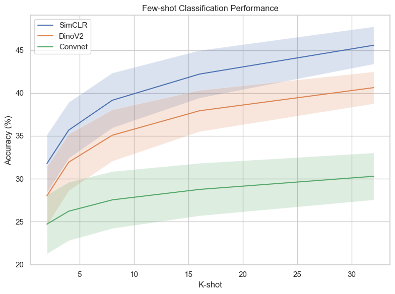

# Prototype Learning for Few-Shot Medical Image Classification
This project explores two modern directions in representation learning:  
- **Self-Supervised Learning (SSL)** methods like `SimCLR` and `DINO`🦖, which learn powerful embeddings without labels.  
- **Meta-Learning (Prototypical Networks)** for few-shot classification, where the goal is to generalize to *new classes* with very few examples.  

I was motivated by challenges in medical imaging, where labeled data is scarce and models that can generalize across domains would be a huge advantage.  

Here's an outline of what I did here:
- I trained SSL models (`SimCLR`), used `DINO` (pretrained backbone), and `Convnet` (ProtoNet trained) on **PathMNIST** to compare their embeddings.  
- I visualized these embeddings with **t-SNE** and **UMAP** to see how well classes cluster in low dimensions.  
- I tested **linear probe classification** to measure how separable the representations are.  
- Finally, I experimented with **ProtoNets** for few-shot learning and pushed into **cross-domain evaluation** using a gastric microenvironment dataset from [Lou et al. (2025)](https://www.nature.com/articles/s41597-025-04489-9).

👉 For full ramblings (and story) check out [`docs/prototype.ipynb`](docs/prototype.ipynb) 👈

## Key Takeaways 🎯
- **SSL embeddings are strong**: Even with just a linear probe, `SimCLR`, `DINO`, and a simple `ConvNet` produced competitive results.  
- **Bigger isn’t always better**: `SimCLR` (trained on domain-specific data) sometimes outperformed the large pretrained `DINO`.  
- **Compute cost matters**: `ConvNet` was fast and effective, while `SimCLR` took days to train. Pretrained `DINO` is powerful, but heavy to train from scratch.  
- **Embeddings show structure**: UMAP and t-SNE visualizations showed meaningful clusters, even across domains.  
- **Cross-domain remains tough**: ProtoNet struggled, but performance improved when using pretrained encoders.  

## Storybook 📷
### 1. PathMNIST Class Data Viz

  

<em>Figure 1: Sample PathMNIST images with class labels. Each class corresponds to a different histopathology tissue type.</em>

### 2. UMAP Embeddings

  
  
  <!-- some weird scaling here oops -->
   

<em>Figure 2: UMAP embeddings from different encoders (SimCLR, DINO, and Convnet). Each shows clustering of classes, with varying separation quality. Notice that classes seemingly tend to stay adjacent to each other.</em>

### 3. Cross-Domain + Prototype Embeddings

  
  
  

<em>Figure 3: Cross-domain UMAP embeddings with ProtoNet prototypes for SimCLR, DINO, and Convnet using gastric histology images. Even across domains, embeddings retain some structure, and prototypes highlight loose class organization.</em>

### 4. K-Shot Evaluation

  

<em>Figure 4: Comparison of K-shot evaluation between SimCLR, DINO, and Convnet using (cross-domain) gastric images. It's interesting to note that despite low accuracy, domain specific SimCLR performed better than DINO, suggesting that training on similar domains improves performance.</em>

## Future Work 🚀
- Run **proper N-way K-shot validation**: fixing my oversight of using all classes in pretraining.  
- Test **further domain shifts**: e.g., CARS 🚗 dataset to see when generalist models shine.  
- Explore **newer few-shot methods**: like LDP-Net and other architectures from recent papers.  
- Investigate **efficiency vs. performance tradeoffs**: since cheaper methods may be more practical in real-world medical contexts.  
- Investigate **clustering phenomena**: where some classes group together similarly despite different training regimes.

## Resources 📚
- Meta-Learning [(Phillip Lippe @ UvA)](https://uvadlc-notebooks.readthedocs.io/en/latest/tutorial_notebooks/tutorial16/Meta_Learning.html)
- SSL Contrastive Learning [(Phillip Lippe @ UvA)](https://uvadlc-notebooks.readthedocs.io/en/latest/tutorial_notebooks/tutorial17/SimCLR.html)
- Prototypical Networks for Few-shot Learning [(Snell et al., 2017)](https://www.cs.toronto.edu/~zemel/documents/prototypical_networks_nips_2017.pdf)
- A Cross-Domain Few-Shot Learning Method Based on Domain Knowledge Mapping [(Chen et al., 2025)](https://arxiv.org/abs/2504.06608)
- Revisiting Prototypical Network for Cross Domain Few-Shot Learning [(Zhou et al., 2023)](https://openaccess.thecvf.com/content/CVPR2023/papers/Zhou_Revisiting_Prototypical_Network_for_Cross_Domain_Few-Shot_Learning_CVPR_2023_paper.pdf)
- MedMNIST v2-A large-scale lightweight benchmark for 2D and 3D biomedical image classification [(Yang et al., 2023)](https://medmnist.com/)
- MedMNIST Classification Decathlon: A Lightweight AutoML Benchmark for Medical Image Analysis [(Yang et al., 2021)](https://medmnist.com/)
- A large histological images dataset of gastric cancer with tumour microenvironment annotation for AI [(Lou et al., 2025)](https://www.nature.com/articles/s41597-025-04489-9)
- DINOv2 [(Meta)](https://github.com/facebookresearch/dinov2)
- YT, the miscellaneous blog posts, and ChatGPT for the tough questions
